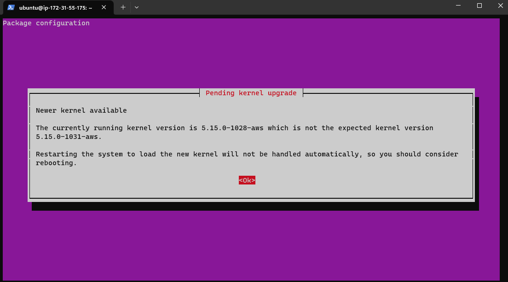
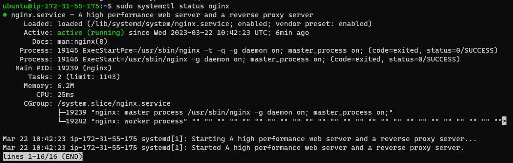
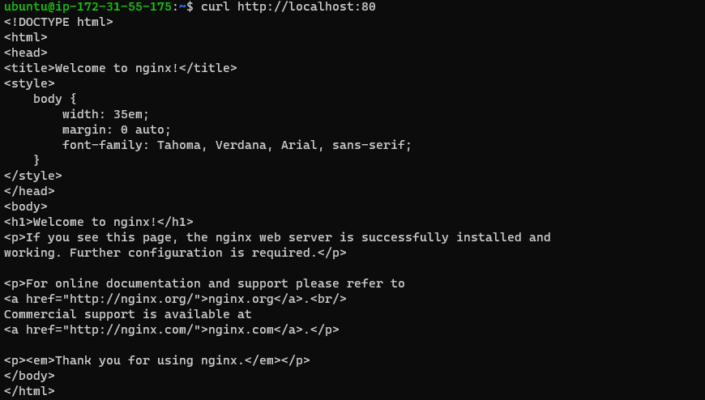
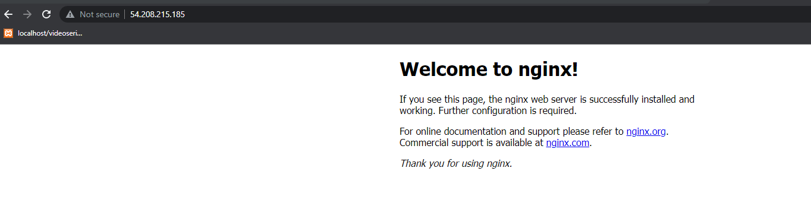
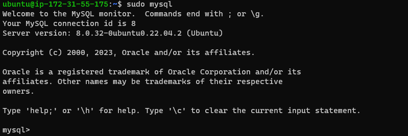
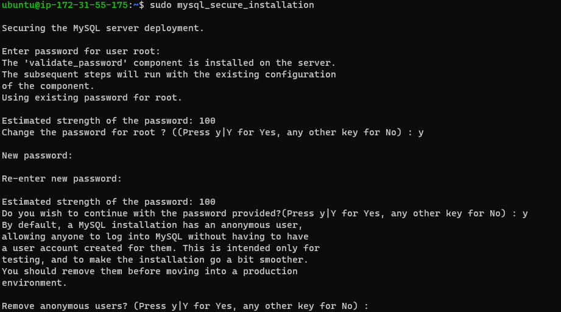
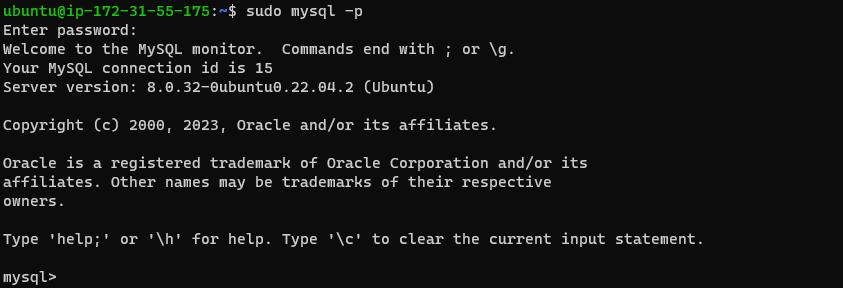
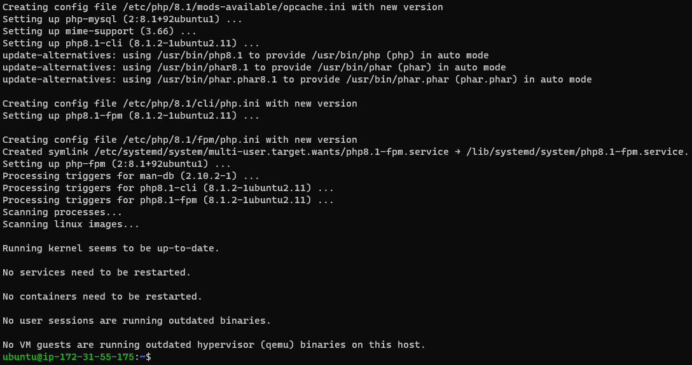

## **Documentation for Project 2**

### nginx Installation 

`sudo apt update`
`sudo apt install nginx`

`sudo systemctl status nginx`

### nginx Server Installation Process

### Opening nginx port 80
`curl http://localhost:80`

### nginx server internet response test
`http://<Public-IP-Address>:80`

## **Mysql Installation**
- `sudo apt install mysql-server`
- `sudo mysql`

### mysql security script 
`sudo mysql_secure_installation`
`ALTER USER 'root'@'localhost' IDENTIFIED WITH mysql_native_password BY 'PassWord.1';`

### mysql successful login
`sudo mysql -p`

## **PHP Installation**
`sudo apt install php-fpm php-mysql`
