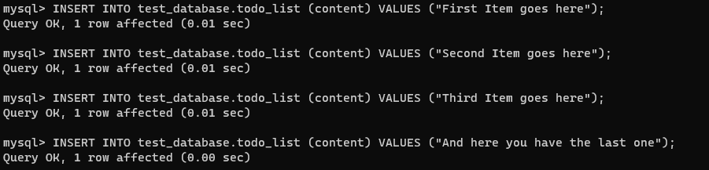

## **Documentation for Project 2**

### nginx Installation 

`sudo apt update`
`sudo apt install nginx`

`sudo systemctl status nginx`

### nginx Server Installation Process

### Opening nginx port 80
`curl http://localhost:80`

### nginx server internet response test
`http://<Public-IP-Address>:80`

## **Mysql Installation**
- `sudo apt install mysql-server`
- `sudo mysql`

### mysql security script 
`sudo mysql_secure_installation`
`ALTER USER 'root'@'localhost' IDENTIFIED WITH mysql_native_password BY 'PassWord.1';`

### mysql successful login
`sudo mysql -p`

## **PHP Installation**
`sudo apt install php-fpm php-mysql`

## **Configuring nginx to use php processor**
- `sudo mkdir /var/www/projectLEMP`
- `sudo chown -R $USER:$USER /var/www/projectLEMP`
- `sudo nano /etc/nginx/sites-available/projectLEMP`
- `sudo ln -s /etc/nginx/sites-available/projectLEMP /etc/nginx/sites-enabled/`

### mysql successful login
`http://<Public-IP-Address>:80`

## **Testing php with nginx**
### creating info.php test file in root directory
`sudo nano /var/www/projectLEMP/info.php`

### removing info.php file from root directory
`sudo rm /var/www/projectLEMP/info.php`

## **Accessing database content via PHP**
### test database creation
`CREATE DATABASE `test_database`;`

### test user creation with password
`CREATE USER 'example_user'@'%' IDENTIFIED WITH mysql_native_password BY 'password';`

### Granting new user Priviledges
`GRANT ALL ON example_database.* TO 'example_user'@'%';`

### new user Login
`mysql -u example_user -p`

### created database verification
`SHOW DATABASES;`

### created database verification
`SHOW DATABASES;`

### to_do list table creation
`CREATE TABLE test_database.todo_list ( item_id INT AUTO_INCREMENT, content VARCHAR(255), PRIMARY KEY(item_id) );`

### populating to_do list table with values
`INSERT INTO test_database.todo_list (content) VALUES ("First item goes here");`

### accessing database content via php on web
`http://4.202.233.76/todo_list.php`

